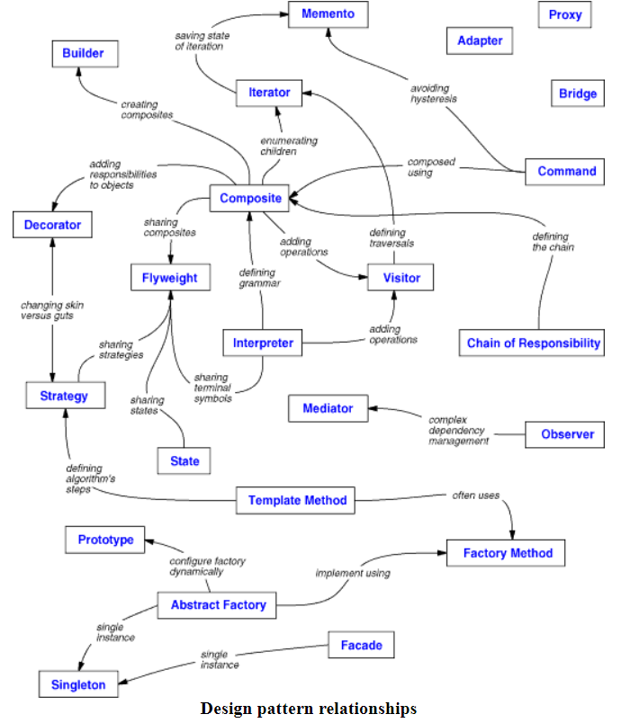

# Design Patterns
 #### “Design patterns are very useful when we study how they work so we can create similar patterns. They are bad when we try to copy them directly.”
(Anonymous)

The above quotes tells both it's significant if understood & implemented correctly & at the same time it can lead to the disasters if the need
is not identified & the wrong pattern is used.
The design pattern is always a topic of discussion in interviews, conferences, podcasts, software design approaches.
There were 30+ patterns. All were mainly categorized into 3 categories:
+ Creational patterns: Provide the way to create an object or series of objects by hiding the object creation implementation.
+ Structural patterns: It establishes the relationship between the classes & objects. It highly uses inheriance & composition.
+ Behavioral patterns: This completely focuses on how objects communicate with each other.

# Design patterns with Kotlin
Kotlin is a very modern language & aims to solve modern problems. There are some features introduced in Kotlin which changes completely the 
way U approach design patterns.

# Design Patterns are universal 
###### Design patterns are typical solutions to commonly occurringproblems in software design. They are like pre-made blueprints that you can customize to solve a recurring design problem in your code.
____
### Wiki:
###### https://en.wikipedia.org/wiki/Design_Patterns
Cheerful!

### References:
- 

-  Kotlin Design Patterns and Best Practices (2e)
###### https://www.packtpub.com/product/kotlin-design-patterns-and-best-practices-second-edition/9781801815727